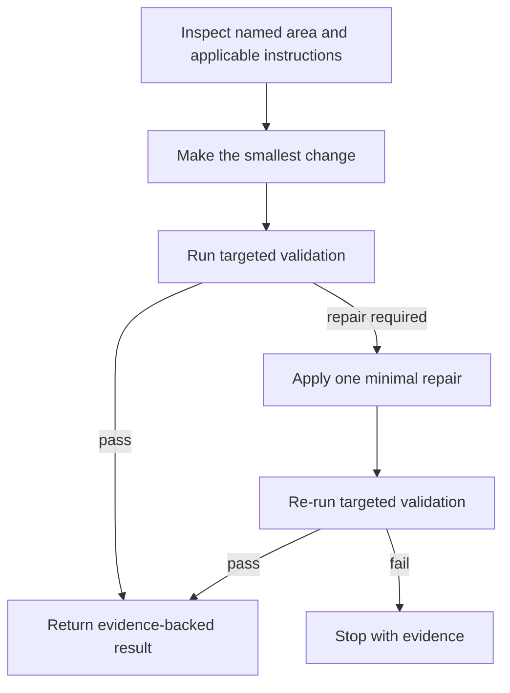
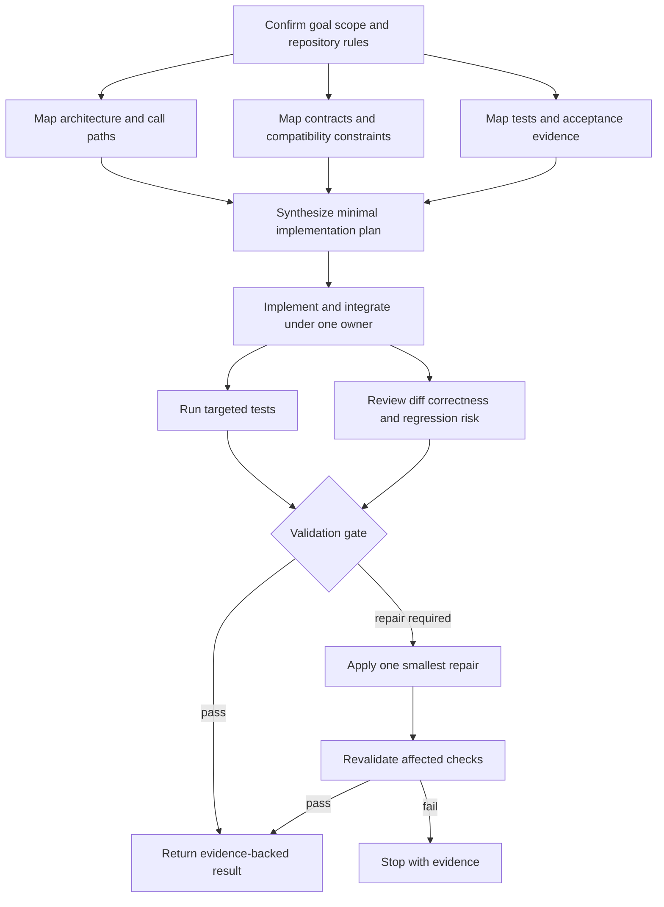
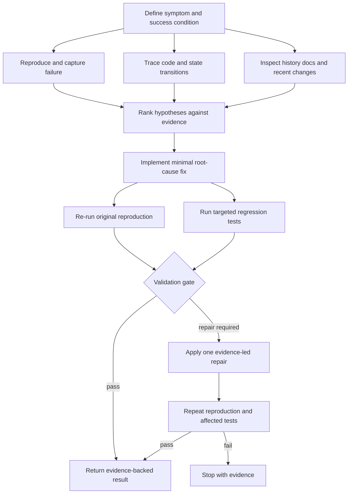
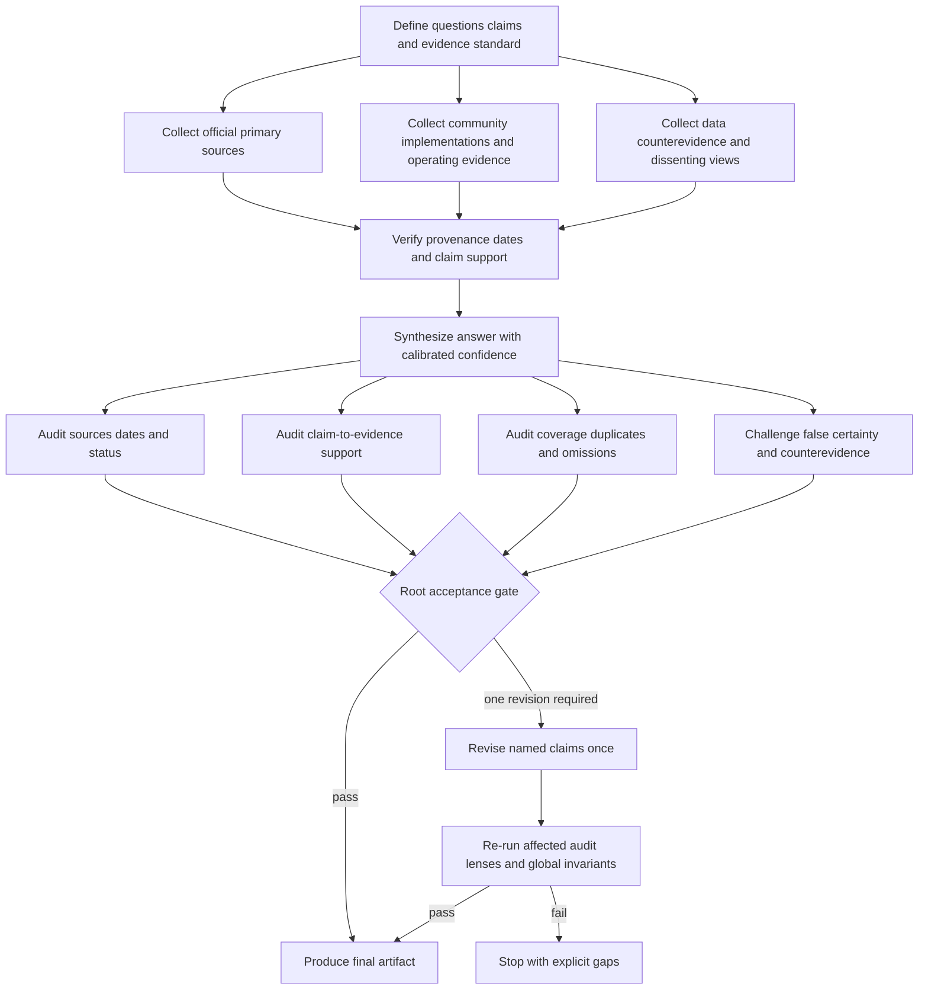
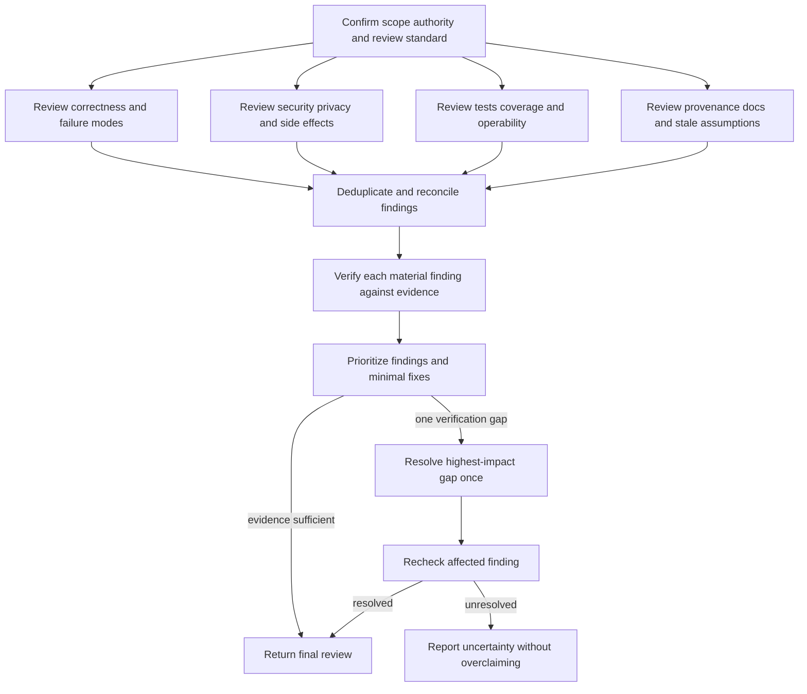
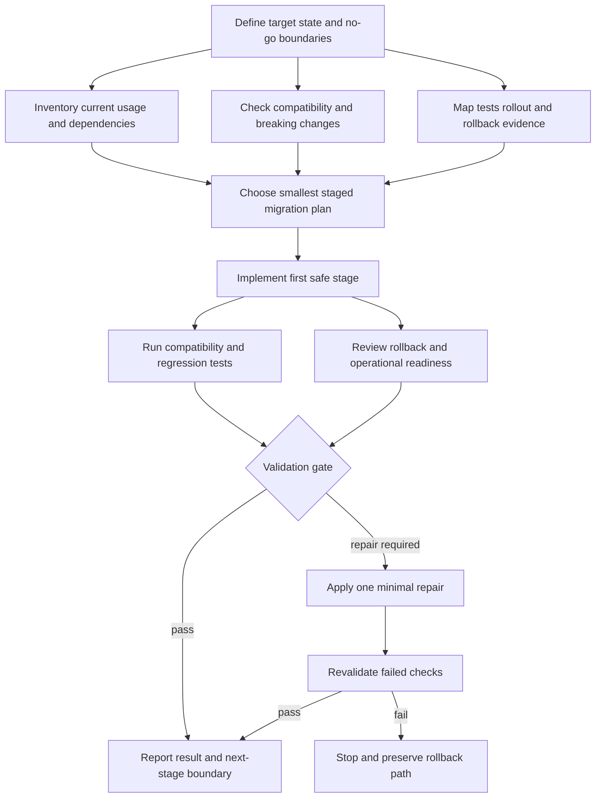

# Topology library

Use these patterns as starting points for Part 1 and as the execution skeleton for Part 2. Rename every node, tailor every contract, and preserve the same node IDs in the JavaScript `WORKFLOW` metadata. Do not force parallelism onto a trivial task.

Select the lowest progressive-complexity tier whose trigger is already proven.
The small-change pattern is the explicit L0 baseline. Each pattern notes which
stages are escalation-gated rather than baseline.

## Artifact boundary

The topology describes repeatable work execution, not the lifecycle of every
input or evaluation asset. Create and version prerequisite artifacts separately,
then pass stable references into the graph. This includes eval cases, fixtures,
benchmark data, rubrics, reference answers, seed datasets, and scoring
harnesses. A graph can consume an existing evaluator or emit evidence for an
external scorer, but artifact creation and post-run scoring are not graph nodes
unless they are explicitly the repeatable work being requested.

## Selection guide

| Task family | Safe parallel work | Serialized authority | Typical gate | Script shape |
|---|---|---|---|---|
| Small change | Usually none; optionally location and test scans | Edit and acceptance | Targeted test or static check | One worker, validator, conditional repair |
| Feature or refactor | Architecture, contract, test, and dependency scans | Plan, overlapping writes, integration | Tests plus diff review | Parallel reconnaissance, one writer, parallel validation |
| Debugging or investigation | Reproduction, trace, history, competing hypotheses | Root-cause decision and fix | Original reproduction plus regression test | Parallel evidence workers, one fixer, two checks |
| Research or analysis | Official sources, community evidence, counterevidence | Claim reconciliation and synthesis | Claim/citation audit | Parallel collectors, one synthesizer, one verifier |
| Audit or review | Correctness, security/privacy, tests, provenance | Deduplication and severity | Evidence verification | Parallel lenses, one reconciler, one verifier |
| Migration or rollout | Inventory, compatibility, tests, rollback analysis | Sequencing and integration | Compatibility and rollback checks | Parallel inventory, one staged implementer, two checks |
| Mixed | Bounded decomposition and independent branches | Cross-branch synthesis | Goal-specific | One decomposition stage, bounded branch batches, one join |

## Pattern: small change

Use when the change is narrow and extra workers would add coordination cost.

**Script mapping:** run `N1` and `N2` in one implementation-owner prompt when their separation adds no value; keep their IDs in the workflow metadata. Parse `V1` as machine-readable JSON. Use one conditional `if` for `R1` and `V2`.
**Tier:** L0 baseline; `R1` and `V2` are conditional repair stages, not baseline.

## Pattern: feature or refactor

Parallelize reconnaissance. Keep integration under one owner. Split implementation only for disjoint write scopes.

**Script mapping:** spawn `N2A–N2C` concurrently after `N1`; wait for all required handoffs; give them to one `N3/N4` integration owner. Run `V1A` and `V1B` concurrently only because they are read-only after integration. Join both into one gate decision.
**Tier:** L2 baseline for bounded discovery; `V1A`, `V1B`, and `G1` are L3
escalation-gated validation stages.

## Pattern: debugging or investigation

Collect independent evidence before selecting a hypothesis.

**Script mapping:** parallel workers may propose hypotheses but cannot choose the root cause. `N3` is the sole evidence-reconciliation agent. `N4` is the sole writer unless the goal proves disjoint scopes.
**Tier:** L2 when competing evidence is proven; parallel evidence workers and
the extra validation lane are escalation-gated.

## Pattern: research or analysis

Use source diversity and independent audit lenses. Keep synthesis distinct from collection and root acceptance.

**Script mapping:** `N1` freezes one acceptance contract, including the pilot size, selection rule, required evidence fields, audit thresholds, publication rule, and repair boundary. Source collectors return concise claim/evidence indexes, preserve full acceptance evidence in a durable artifact, and put deferred candidates in an expansion queue. `N3/N4` receives bounded handoffs and owns reconciliation into one canonical record schema. Run `V1A-V1D` concurrently because they are read-only and independent; each returns strict JSON with affected claim IDs and declared criterion IDs. Only `G1` can accept the artifact or set the single repair scope. If many records fail, `R1` may use bounded record-specific correction shards, but one serial owner must normalize and integrate them once before `V2`.
**Tier:** L2 for source discovery, L3 for independent audit lenses, and L4
for the expansion queue, record-specific repair shards, checkpoints, and
resume. The collectors, audit lanes, `G1`, and L4 repair machinery are
escalation-gated unless their triggers are proven at design time.

## Pattern: audit or review

Use independent lenses, then deduplicate and verify before assigning severity.

**Script mapping:** fan out `N2A–N2D` with a maximum of four workers. Only `N3` can deduplicate or assign canonical finding IDs. Treat the repair path as evidence repair, not permission to modify the reviewed system unless requested.
**Tier:** L3 when independent review lenses are proven; `N2A–N2D` and the join
are escalation-gated. The baseline is one review owner and one validator.

## Pattern: migration or rollout

Front-load compatibility and rollback analysis. Keep implementation staged.

**Script mapping:** `N4` implements only the first safe stage. The graph must not silently continue to later rollout stages. Approval-gated deployment remains a terminal boundary, not a worker action.
**Tier:** L2 for independent inventory and compatibility discovery; additional
validation is escalation-gated.

## Mixed-task adaptation

For a mixed goal, add a short decomposition stage that produces a finite list of branches and proves their independence. Execute branches with the active tool's supported concurrency; if a measured limit appears, use staged fan-in. Join them under one synthesis owner. Do not allow branches to spawn their own agents.

## General adaptation rules

- Add a current-documentation branch to coding work when an API or version may have changed.
- Add a security/privacy lens only when the goal touches trust boundaries, credentials, personal data, permissions, or untrusted input.
- Add a performance branch only when the goal has a measurable performance requirement.
- Do not split tightly coupled implementation merely to create visual parallelism.
- Prefer a fresh validator that receives acceptance criteria, the diff or artifact, and raw evidence rather than the implementer's narrative alone.
- Keep terminal states explicit: passed, blocked, failed, or unresolved with evidence.
- Keep graph labels readable; put detailed prompts and handoff schemas in node contracts and the JavaScript, not inside Mermaid boxes.
- When a graph node is represented by a gate rather than a worker, encode it as an explicit function or conditional in the script and list it in `WORKFLOW.nodes`.
